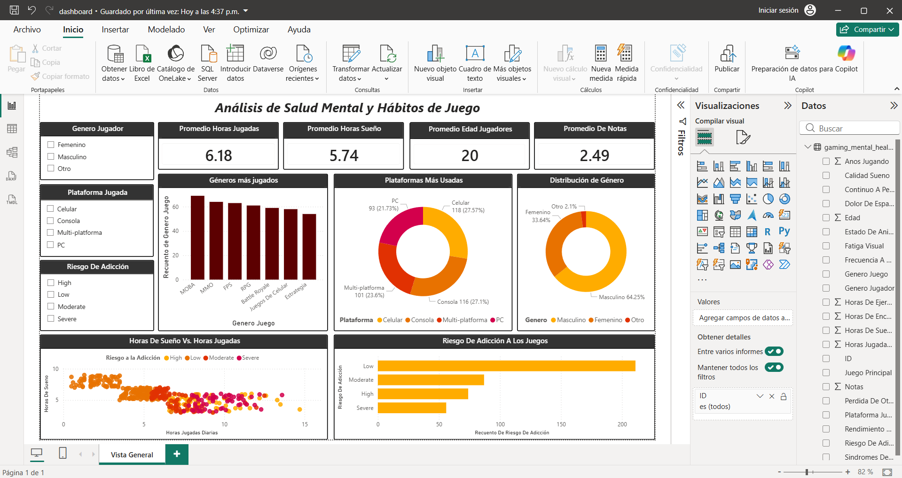
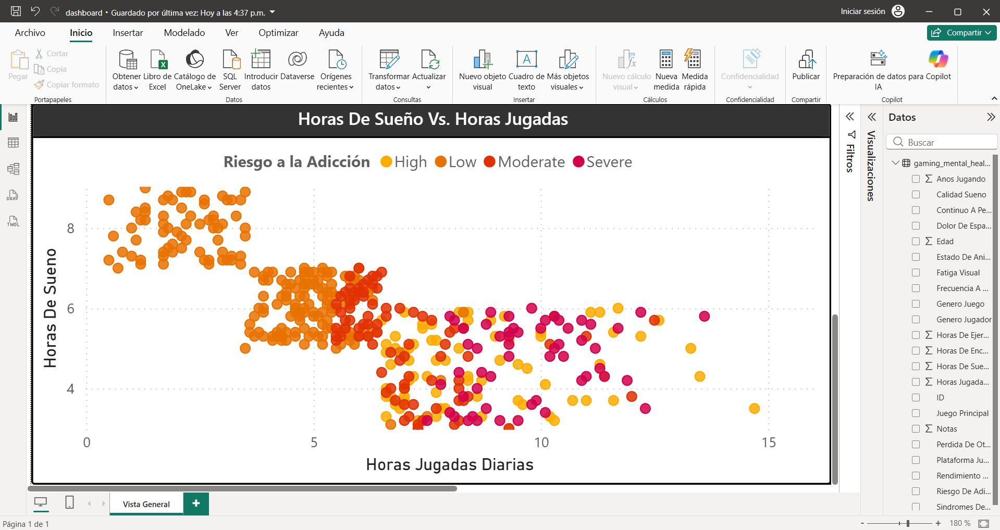
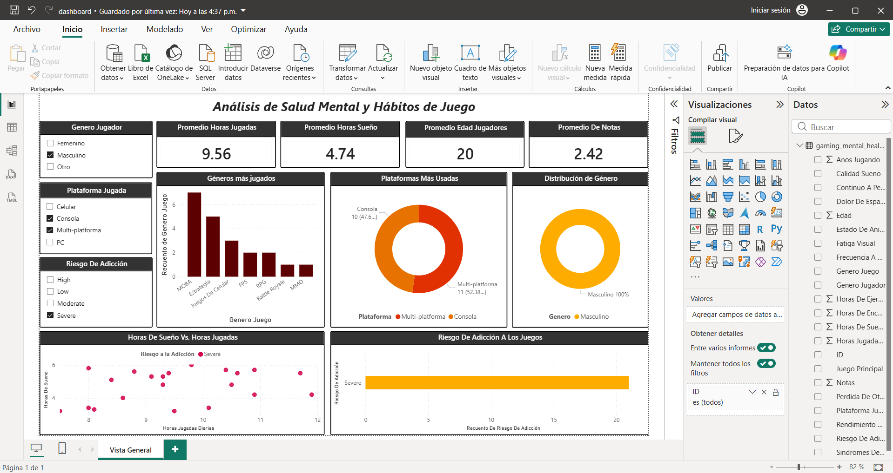

# Análisis de Salud Mental y Hábitos de Juego

Proyecto de análisis de datos enfocado en la relación entre hábitos de juego, calidad del sueño y riesgo de adicción utilizando Python, Pandas y Power BI.

---

# Objetivos del Proyecto

- Limpiar y transformar datos relacionados con hábitos de juego.
- Analizar patrones de sueño y rendimiento académico.
- Explorar posibles relaciones entre horas de juego y salud mental.
- Crear un dashboard interactivo para visualización de datos.

---

# Herramientas Utilizadas

- Python
- Pandas
- Jupyter Notebook
- Power BI

---

# Estructura del Proyecto

```plaintext
datos/
│
├── crudos/
├── limpios/

notebooks/
dashboard/
imagenes/
```

---

# Proceso de Limpieza y Preparación

Durante el análisis se realizaron procesos como:

- Eliminación de valores nulos e inconsistentes.
- Traducción y estandarización de variables.
- Corrección de categorías relacionadas con calidad del sueño.
- Ajuste de variables académicas y categóricas.
- Preparación del dataset para visualización en Power BI.

---

# Dashboard General



---

# Visualizaciones Destacadas

## Relación Entre Horas de Sueño y Juego



---

## Distribución de Riesgo de Adicción



---

# Insights Principales

- Los jugadores con mayores horas de juego tienden a presentar menos horas de sueño.
- Los niveles altos de riesgo de adicción se relacionan con sesiones de juego más extensas.
- Los géneros competitivos presentan alta frecuencia entre los participantes.
- El dashboard permite explorar relaciones entre variables mediante filtros interactivos.

---

# Cómo Ejecutar el Proyecto

## Notebook

Abrir el archivo `.ipynb` ubicado en la carpeta `notebooks`.

## Dashboard

Abrir el archivo `.pbix` ubicado en la carpeta `dashboard` utilizando Power BI Desktop.

---

# Autor

Juan Diego Carreño Moreno